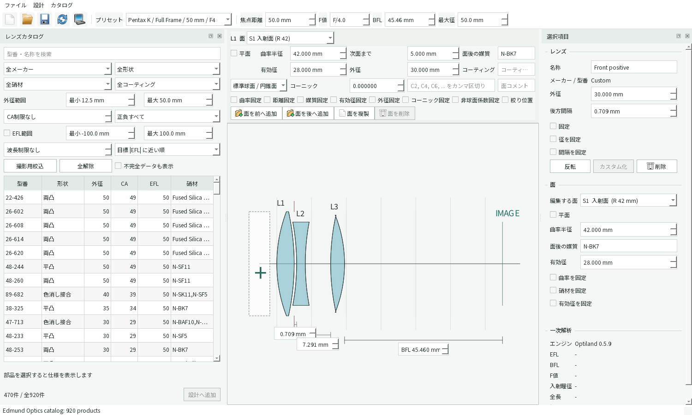
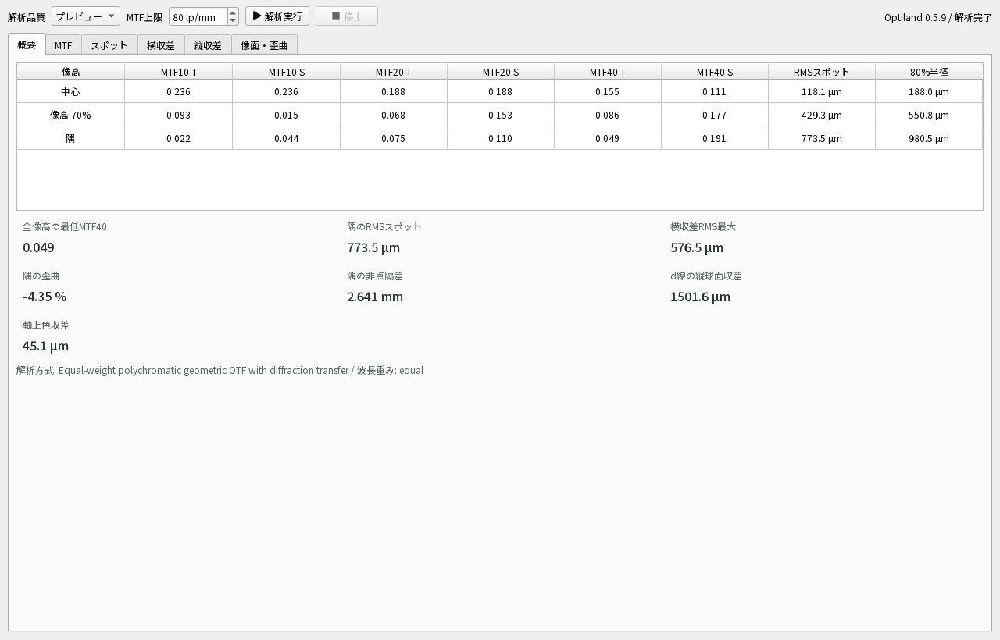

# KiraKiraLens

KiraKiraLens is a Windows desktop application for building photographic lens
systems from commercially available singlets and cemented assemblies. The lens
cross-section is the primary editor; a synchronized surface table is available
for exact numeric work. Optiland performs the optical modeling and analysis.

The current milestone includes:

- a full-frame 50 mm F/4 Pentax K target preset;
- a diagram-first PySide6 editor with element reversal and locking;
- an Edmund Optics catalog database generated from the supplied workbooks;
- catalog filtering and insertion into the current design;
- versioned `.kklens` project save/load;
- cached, non-blocking Optiland first-order analysis;
- a manual performance window for polychromatic MTF, spot, transverse and
  longitudinal aberration, field curvature, and distortion.





## Setup

```powershell
python -m venv .venv
.\.venv\Scripts\python -m pip install -e ".[dev]"
```

## Import the supplied Edmund workbooks

```powershell
.\.venv\Scripts\kirakiralens-import-edmund
```

This reads `data/source/edmund/*.xlsx` without modifying them and writes:

- `data/generated/edmund_catalog.sqlite3`
- `data/generated/edmund_catalog.csv`
- `data/generated/edmund_import_report.json`

## Run

```powershell
.\.venv\Scripts\kirakiralens
```

The detailed product requirements live in
[`docs/DEVELOPMENT_PROMPT.md`](docs/DEVELOPMENT_PROMPT.md).
The current implementation status and known limitations are recorded in
[`docs/IMPLEMENTATION_STATUS.md`](docs/IMPLEMENTATION_STATUS.md).
The definitions, units, references, and optimizer-facing performance metrics
are recorded in [`docs/PERFORMANCE_ANALYSIS.md`](docs/PERFORMANCE_ANALYSIS.md).
